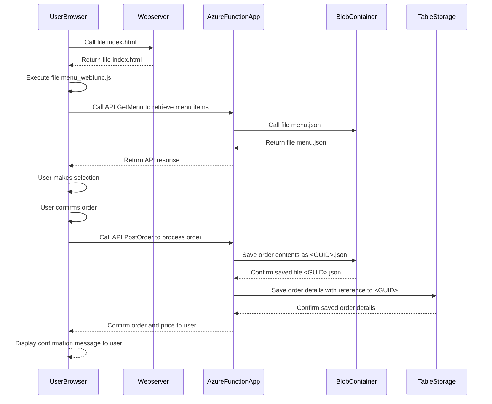
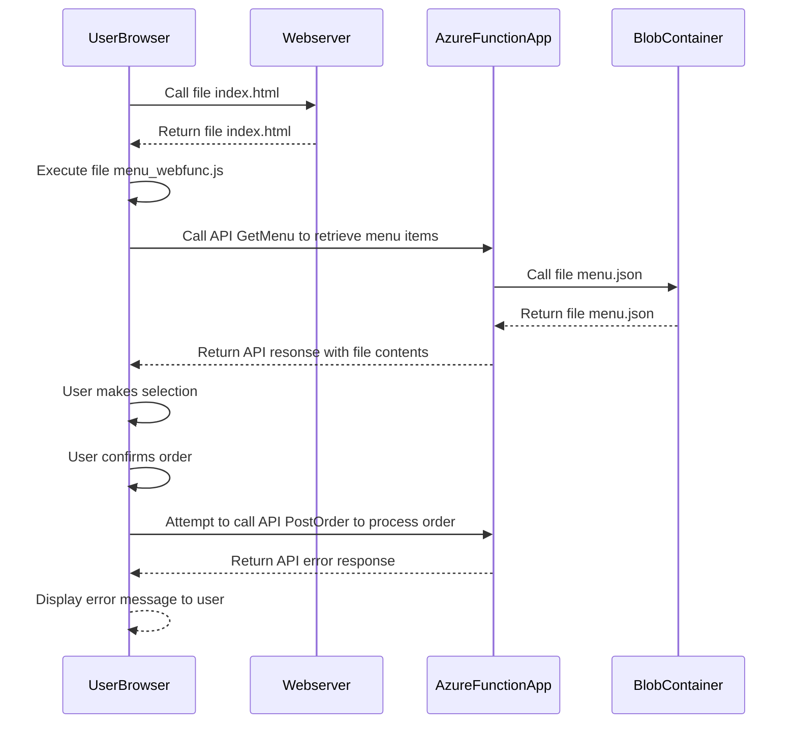

# Dev Bootcamp Project
## **Project description**
This project contains the end-products of the Dev Bootcamp exercises, as prescribed by our Master of Computers Yasen. The contents of each folder provide the required files to execute the program. This README explains what each project encompasses and how to execute it.

The ultimate end-product is a web interface that allows users to order delicious food at the Blue10 Restaurant (see: https://tijnsite.z6.web.core.windows.net/). The full stack works perfectly fine, the only thing left to arrange is a cook and a delivery guy.

This page explains the following elements:
* A description (with sequence diagrams) of the web interface
* Prerequisites to run files from earlier tasks
* Description of earlier tasks

## **Web interface**
The web interface allows users to place an order at the restaurant website. The most recent menu version is displayed, after which a user can order any number of menu items they desire. After confirming an order, order details are stored in an Azure TableStorage, whereas the order contents are stored in an Azure BlobStorage. Below you find a visual description of the process by means of a sequence diagram for two main scenarios:
1. Happy flow
2. Sad flow: API to confirm and place order does not respond

### Happy flow:

### Sad flow: API PostOrder does not respond.

## **Prerequisites to run earlier tasks locally**
To be able to run all programs smoothly, apply the following steps:
1. Execute `npm install prompt-sync` in the Terminal.
2. Make sure the Project folder is set as your working directory.

Good to go!

## **Task overview**
### 1. Murtle Grr
***Description***:
This program generates a random personal mission for you! After inserting your name, a cool scenario is provided in which you will be able to save the world!

***Commands***: 
1. `cd ./1_MurtleGrr`
2. `./MurtleGrr.ps1`

### 2. PowerShell Restaurant
***Description***:
This program lets you visit the amazing PowerShell restaurant. Insert the commands and treat yourself to a nice dinner!

***Commands***:
1. `cd ./2_PowerShellRestaurant`
2. `./Menukaart.ps1`

### 3. NodeJS Restaurant
***Description***:
Right next to the PowerShell Restaurant, a new competitor opened shop. Go check out NodeJS Restaurant's menu!

***Commands***:
1. `cd ./3_NodeJSRestaurant`
2. `node Menukaart`

### 6. .NET Restaurant
***Description***:
Competition is fierce! A fourth competitor has presented itself. 

***Commands***:
1. `cd ./6_Dotnet`
2. `./bin/Debug/net6.0/6_Dotnet.exe`
